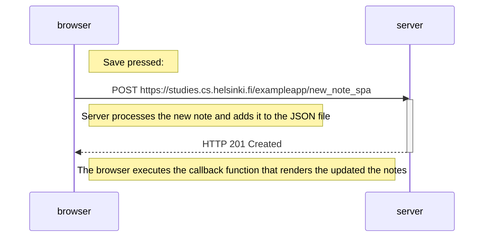

```mermaid
sequenceDiagram
    participant browser
    participant server

    Note right of browser: Save pressed:
    browser->>server: POST https://studies.cs.helsinki.fi/exampleapp/new_note_spa
    activate server
    Note right of browser: Server processes the new note and adds it to the JSON file
    server-->>browser: HTTP 201 Created
    deactivate server

    Note right of browser: The browser executes the callback function that renders the updated the notes
```
